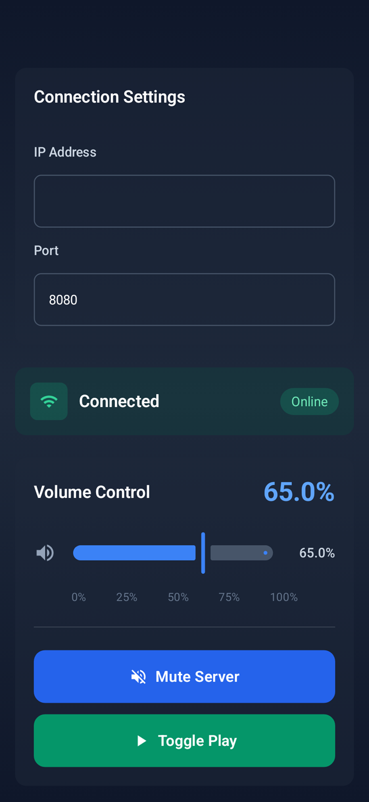

# 📱 Mobile Remote Client

A simple and intuitive Android app that lets you remotely control media playback and volume on your Windows PC 🎬🔊

This mobile client connects to a **Mobile Remote Server** (a desktop app for Windows) and allows you to:

- 🔈 Adjust system volume  
- 🔇 Mute/unmute the server  
- ⏯️ Play/Pause video playback  

Perfect for scenarios where your laptop is just out of reach — like watching movies on an external monitor from your bed 🛋️🍿

---

## ✨ Features

- 🔗 Connect to a Windows server via IP and port
- 📶 Status indication (connected / disconnected)
- 📊 Smooth volume slider with real-time feedback
- 🟦 Mute server
- 🟩 Toggle play/pause

---

## 🛠 Tech Stack

- **Kotlin** – Primary language  
- **Jetpack Compose** – UI framework  
- **Ktor** – HTTP client for communication  

---

## 🚀 Getting Started

### 1. Setup the Server 🖥️

You’ll need to set up the **Mobile Remote Server** on your Windows machine.  
👉 [Link to Server Project](#) *(Insert your server repo link here)*

### 2. Install the Mobile Client 📲

- Download the APK bundle from the [Releases](#) section *(insert release link if available)*  
- Install it on your Android device (you may need to allow unknown sources)

---

## 🔌 Connection Instructions

1. Ensure both your Android device and Windows machine are on the same network.
2. Launch the **Mobile Remote Server** on your PC.
3. Open the Mobile Remote Client on your phone.
4. Enter the IP address of your Windows machine.
5. Port defaults to `8085`, but you can change it if needed.
6. Once connected, you're good to go!

---

## 📸 Screenshot

Here's what the app looks like in action:

![Mobile Remote Client UI]

*(Replace with actual hosted image link if needed)*

> Note: In the screenshot, the device is connected to the server, and volume is set to 65%.

---

## ⚠️ Disclaimer

This project is for **personal use only**. No support or maintenance is guaranteed.  
Feel free to fork or modify it as you wish.

---

Enjoy effortless control from across the room! 🚀📱💻  
